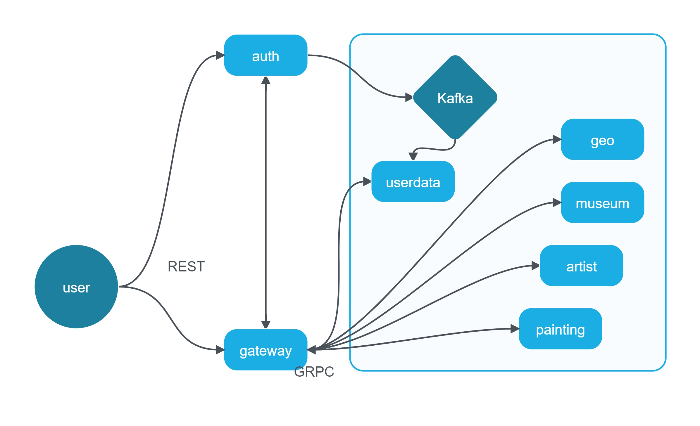
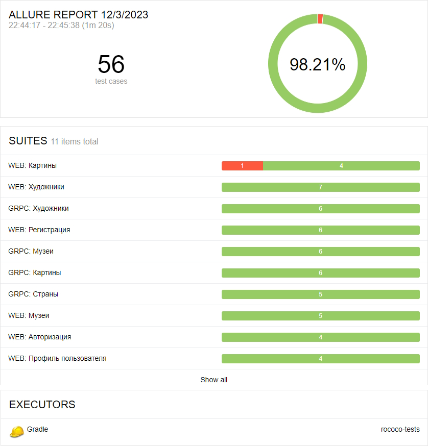
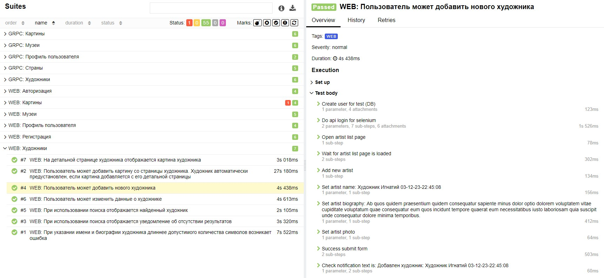

# Rococo


**Rococo - путеводитель в мире живописи! Исследуйте уникальные картины, познакомьтесь с их авторами, загляните в музеи
из разных уголков мира.**

## Оглавление

- [Используемые технологии](#techonology)
- [Архитектура приложения](#architecture)
- [Список портов приложения](#ports)
- [Запуск Rococo локально в IDE](#local-run)
- [Запуск Rococo в докере](#docker-run)
- [Запуск тестов локально](#local-run-tests)
- [Запуск тестов в докере](#docker-run-tests)
- [Пример тестового отчёта](#report)

<a name="techonology"></a>
# Используемые технологии

- [Spring Authorization Server](https://spring.io/projects/spring-authorization-server)
- [Spring OAuth 2.0 Resource Server](https://docs.spring.io/spring-security/reference/servlet/oauth2/resource-server/index.html)
- [Spring Data JPA](https://spring.io/projects/spring-data-jpa)
- [Spring Web](https://docs.spring.io/spring-framework/docs/current/reference/html/web.html#spring-web)
- [Spring Actuator](https://docs.spring.io/spring-boot/docs/current/reference/html/actuator.html)
- [Spring gRPC by https://github.com/yidongnan](https://yidongnan.github.io/grpc-spring-boot-starter/en/server/getting-started.html)
- [Apache Kafka](https://kafka.apache.org/)
- [Docker](https://www.docker.com/resources/what-container/)
- [Docker-compose](https://docs.docker.com/compose/)
- [MySQL](https://www.mysql.com/about/)
- [Svelte](https://ru.reactjs.org/docs/getting-started.html)
- [JUnit 5 (Extensions, Resolvers, etc)](https://junit.org/junit5/docs/current/user-guide/)
- [Retrofit 2](https://square.github.io/retrofit/)
- [Allure](https://docs.qameta.io/allure/)
- [Selenide](https://selenide.org/)
- [Selenoid & Selenoid-UI](https://aerokube.com/selenoid/latest/)
- [Allure-docker-service](https://github.com/fescobar/allure-docker-service)
- [Java 17](https://www.oracle.com/java/technologies/javase/jdk17-archive-downloads.html)
- [Gradle 8](https://docs.gradle.org/8.0/release-notes.html)
- И многое другое!


<a name="architecture"></a>
## Архитектура приложения

Приложение Rococo построено на основе микросервисной архитектуры:

- **auth** - аутентификация и авторизация.
- **gateway** - обработка запросов клиента и вызов нужных микросервисов.
- **userdata** - информация о пользователе: юзернейм, имя и фамилия, аватар.
- **geo** - данные о странах мира.
- **museum** - сведения о музеях.
- **artist** - сведениях о художниках.
- **painting** - сведениях о картинах.
- frontend - интерфейс приложения, с которым взаимодействует пользователь

Напрямую пользователь общается по <b>REST</b> только с сервисами <b>auth</b> и <b>gateway</b> и ничего не знает о существовании других сервисов. 
В то время как микросервисы - ничего не знают об аутентификационных данных пользователя, ведь они общаются только с <b>gateway-сервисом</b> по <b>GRPC</b>, 
который получает информацию об авторизации из <b>auth-сервиса</b>.


<a name="ports"></a>
## Список портов приложения

|  Сервис  |     Порт      |
|:--------:|:-------------:|
|   AUTH   | 9000 (server) |
| GATEWAY  | 8090 (server) |
| USERDATA |  8091 (grpc)  |
|  ARTIST  |  8092 (grpc)  |
|  MUSEUM  |  8093 (grpc)  |
|   GEO    |  8094 (grpc)  |
| PAINTING |  8095 (grpc)  |
| FRONTEND |  80 (server)  |

**Минимальные предусловия для запуска проекта локально**

- На Windows рекомендуется используется терминал bash, а не powershell
- Установить Java версии 17 или новее. Это необходимо, т.к. проект не поддерживает версии <17
- Установить пакетный менеджер для сборки front-end npm <br>
[Инструкция](https://docs.npmjs.com/downloading-and-installing-node-js-and-npm) Рекомендованная версия Node.js - 18.13.0 (LTS)
- Спуллить контейнер mysql:8.0.33, zookeeper и kafka версии 7.3.2
```posh
$ docker pull mysql:8.0.33
$ docker pull confluentinc/cp-zookeeper:7.3.2
$ docker pull confluentinc/cp-kafka:7.3.2
```

- Создать volume для сохранения данных из БД в docker на вашем компьютере
```posh
docker volume create rococo-mysql
```

<a name="local-run"></a>
# Запуск Rococo локально в IDE:

#### 1. Запустить фронтенд, БД, zookeeper и kafka командами:

Запустив скрипт, для *nix:
```posh
$ bash localenv.sh
```

Запустив скрипт, для windows:
```posh
$ bash localenv-windows.sh
```

Или выполнив последовательно команды, для *nix:
```posh
docker run --name rococo-all -p 3306:3306 -e MYSQL_ROOT_PASSWORD=secret -d mysql:8.0.33

docker run --name=zookeeper -e ZOOKEEPER_CLIENT_PORT=2181 -e ZOOKEEPER_TICK_TIME=2000 -p 2181:2181 -d confluentinc/cp-zookeeper:7.3.2

docker run --name=kafka -e KAFKA_BROKER_ID=1 \
-e KAFKA_ZOOKEEPER_CONNECT=$(docker inspect zookeeper --format='{{ .NetworkSettings.IPAddress }}'):2181 \
-e KAFKA_ADVERTISED_LISTENERS=PLAINTEXT://localhost:9092 \
-e KAFKA_OFFSETS_TOPIC_REPLICATION_FACTOR=1 \
-e KAFKA_TRANSACTION_STATE_LOG_MIN_ISR=1 \
-e KAFKA_TRANSACTION_STATE_LOG_REPLICATION_FACTOR=1 \
-p 9092:9092 -d confluentinc/cp-kafka:7.3.2

cd rococo-client
npm i
npm run dev
```

Для Windows:
```posh
docker run --name rococo-all -p 3306:3306 -e MYSQL_ROOT_PASSWORD=secret -d mysql:8.0.33

docker run --name=zookeeper -e ZOOKEEPER_CLIENT_PORT=2181 -e ZOOKEEPER_TICK_TIME=2000 -p 2181:2181 -d confluentinc/cp-zookeeper:7.3.2

docker run --name=kafka -e KAFKA_BROKER_ID=1 -e KAFKA_ZOOKEEPER_CONNECT=$(docker inspect zookeeper --format='{{ .NetworkSettings.IPAddress }}'):2181 -e KAFKA_ADVERTISED_LISTENERS=PLAINTEXT://localhost:9092 -e KAFKA_OFFSETS_TOPIC_REPLICATION_FACTOR=1 -e KAFKA_TRANSACTION_STATE_LOG_MIN_ISR=1 -e KAFKA_TRANSACTION_STATE_LOG_REPLICATION_FACTOR=1 -p 9092:9092 -d confluentinc/cp-kafka:7.3.2

cd rococo-client
npm i
npm run dev
```

Фронт стартанет в браузере на порту 3000: http://127.0.0.1:3000/  
Надо использовать именно 127.0.0.1, а не localhost

#### 2. Прописать run конфигурацию для всех сервисов rococo-* - Active profiles local

Для этого зайти в меню Run -> Edit Configurations -> выбрать main класс -> в поле Environment variables указать
spring.profiles.active=local

#### 3. Запустить сервис rococo-auth c помощью gradle или командой Run в IDE:

```posh
$ cd rococo-auth
$ gradle bootRun --args='--spring.profiles.active=local'
```

Или просто перейдя к main-классу приложения RococoAuthApplication выбрать run в IDEA (предварительно удостовериться, что
выполнен предыдущий **пункт 2**)

#### 4. Запустить в любой последовательности другие сервисы: rococo-gateway, rococo-userdata, rococo-artist, rococo-geo, rococo-museum, rococo-painting

<a name="local-docker"></a>
# Запуск Rococo в докере:

#### 1. Создать бесплатную учетную запись на https://hub.docker.com/ (если отсутствует)

#### 2. Создать в настройках своей учетной записи access_token

[Инструкция](https://docs.docker.com/docker-hub/access-tokens/).

#### 3. Выполнить docker login с созданным access_token (в инструкции это описано)

<a name="hosts"></a>
#### 4. Прописать в etc/hosts элиас для Docker-имени

#### frontend:  127.0.0.1 client.rococo.dc,
#### auth:      127.0.0.1 auth.rococo.dc
#### gateway:   127.0.0.1 gateway.rococo.dc

Для *nix:
```posh
$ vi /etc/hosts
```
```posh
##
# Host Database
#
# localhost is used to configure the loopback interface
# when the system is booting.  Do not change this entry.
##
127.0.0.1       localhost
127.0.0.1       client.rococo.dc
127.0.0.1       auth.rococo.dc
127.0.0.1       gateway.rococo.dc
127.0.0.1       allure
```

В windows файл hosts лежит по пути:
```
C:\Windows\System32\drivers\etc\hosts
```

#### 5. Перейти в корневой каталог проекта

```posh
$ cd rococo
```

#### 6. Запустить все сервисы

```posh
$ bash docker-compose-dev.sh
```

Текущая версия docker-compose-dev.sh удалит все старые Docker контейнеры в системе, поэтому если у Вас есть созданные
контейнеры для других проектов - отредактируйте строку ```posh docker rm $(docker ps -a -q)```, чтобы включить в grep
только те контейнеры, которые относятся к rococo.

Rococo при запуске в докере будет работать для Вас по адресу http://client.rococo.dc:80, этот порт не нужно
указывать в браузере, таким образом переходить напрямую по ссылке http://client.rococo.dc

<a name="local-run-tests"></a>
# Запуск тестов локально

**Обратите внимание! Запуск тестов происходит в три потока. Изменить число потоков можно в
файле [junit-platform.properties](rococo-tests%2Fsrc%2Ftest%2Fresources%2Fjunit-platform.properties)**

1. Запустить приложение локально и запустить тесты из корня проекта
```posh
$ ./gradlew :rococo-tests:clean test
```

2. После прогона тестов запустить формирование отчёта командой:
```posh
$ ./gradlew :rococo-tests:allureServe
```

<a name="docker-run-tests"></a>
# Запуск тестов в докере
0. Добавить в файл hosts строку (как работать с файлом hosts описано в пункте [Прописать в etc/hosts элиас для Docker-имени](#hosts)):

<b>127.0.0.1 allure</b>

Итоговый файл hosts должен выглядеть следующим образом:

```posh
##
# Host Database
#
# localhost is used to configure the loopback interface
# when the system is booting.  Do not change this entry.
##
127.0.0.1       localhost
127.0.0.1       client.rococo.dc
127.0.0.1       auth.rococo.dc
127.0.0.1       gateway.rococo.dc
127.0.0.1       allure
```

1. Запустить скрипт:
```posh
$ bash docker-compose-dev.sh
```

2. После того, как все контейнеры успешно соберутся и запустятся - переключиться на логи контейнера rococo-tests командой:
```posh
$ docker logs -f rococo-tests
```
3. После прогона тестов в логах отобразиться ссылка на аллюр отчёт

<a name="report"></a>
# Пример тестового отчета



